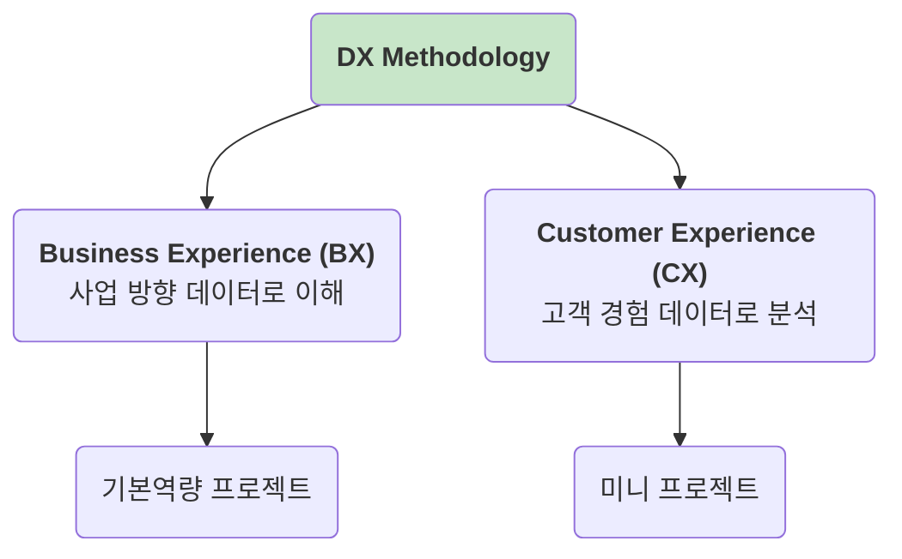

# 🛠️ Phase 2: DX Methodology (DX 핵심 방법론)

이 폴더는 LG DX School의 핵심 목표인 **뛰어난 디지털 경험(Digital Experience, DX)** 을 구축하기 위한 핵심 방법론들을 다룹니다.

DX는 어느 한순간에 만들어지는 것이 아니라, 다음 두 가지 축을 깊이 있게 이해하고 분석하는 과정을 통해 완성됩니다. 이 두 축은 서로 유기적으로 연결되어 시너지를 창출합니다.

---

## 🎯 이 단계의 학습 목표

- **Business Experience (BX)**: 비즈니스와 시장의 관점에서 데이터를 이해하고 사업 방향을 설정하는 능력을 기릅니다.
- **Customer Experience (CX)**: 고객의 관점에서 데이터를 분석하고 새로운 가치를 설계하는 능력을 기릅니다.
- BX와 CX를 결합하여 데이터 기반의 DX 전략을 수립하고 실행할 수 있습니다.

---

## 📖 학습 모듈

| 모듈 명 | 주요 학습 내용 | 바로가기 |
| :-- | :-- | :-- |
| **Business Experience (BX)** | 데이터 관리 전략, 데이터 수집 및 시각화 기술 학습. | [➡️ Go](./1_Business_Experience_BX/) |
| **Customer Experience (CX)** | 데이터 분석 및 기획, 신규 가치 분석 및 설계 방법론 학습. | [➡️ Go](./2_Customer_Experience_CX/) |

---

> "The goal is to turn data into information, and information into insight." - Carly Fiorina 