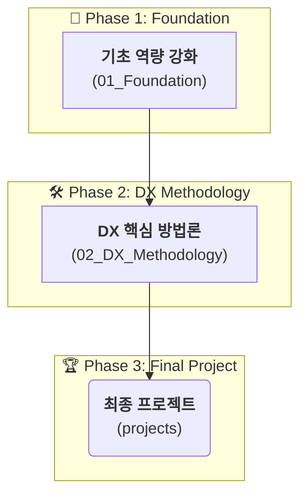

# LG_DX_school

초심을 잃지말자# 🚀 LG DX School 3기 학습 여정

**"초심을 잃지말자"** - 이 저장소는 LG DX School 3기 과정의 모든 학습 내용과 성장 과정을 기록하는 개인적인 공간입니다.

---

## 🧭 이 저장소를 사용하는 방법 (How to Use)

이곳을 여러분의 학습 베이스캠프로 만드세요!

1.  **학습 내용 정리**: 각 과목 폴더(`01_Foundation` 등)의 `README.md`를 수정하거나, 새로운 마크다운 파일을 만들어 배운 내용을 기록하세요.
2.  **코드 실습**: Python, SQL 등 실습 코드는 해당 과목 폴더 내에 저장하여 관리하세요.
3.  **개인 자료 추가**: 강의 외에 찾은 유용한 아티클, 논문, 스터디 노트는 `resources` 폴더에 자유롭게 추가하세요.
4.  **프로젝트 관리**: 미니 프로젝트와 최종 프로젝트의 모든 산출물은 `projects` 폴더에서 체계적으로 관리하세요.

---

## 🗺️ 전체 학습 로드맵 (Learning Roadmap)

우리의 학습 여정은 기초 역량 강화부터 시작하여, DX 핵심 방법론을 거쳐 최종 실무 프로젝트로 완성됩니다.

*전체 흐름을 보려면 [학습 로드맵(`learning_roadmap.md`)](./learning_roadmap.md) 파일을 확인하세요.*

```mermaid
graph TD
    subgraph "🚀 Phase 1: Foundation"
        F["<strong>기초 역량 강화</strong><br/>(01_Foundation)"]
    end

    subgraph "🛠️ Phase 2: DX Methodology"
        DX["<strong>DX 핵심 방법론</strong><br/>(02_DX_Methodology)"]
    end

    subgraph "🏆 Phase 3: Final Project"
        D("<strong>최종 프로젝트</strong><br/>(projects)")
    end

    F --> DX --> D
```

---

## 📚 핵심 학습 모듈 바로가기

| 단계 | 모듈 명 | 설명 | 바로가기 |
| :--: | :-- | :-- | :-- |
| 1 | **Foundation** | Python, 데이터 핸들링, 통계 등 DX 학습의 기초를 다집니다. | [➡️ Go](./01_Foundation/) |
| 2 | **DX Methodology** | BX(사업 경험), CX(고객 경험)를 아우르는 DX 핵심 방법론을 학습합니다. | [➡️ Go](./02_DX_Methodology/) |
| 3 | **Projects** | 기본역량 프로젝트와 최종 실무 프로젝트를 통해 학습한 내용을 실제 문제에 적용합니다. | [➡️ Go](./projects/) |

---

## ✨ 나의 다짐

> 초심을 잃지 않고, 꾸준히 기록하며, 최고의 DX 전문가로 성장하겠습니다.
