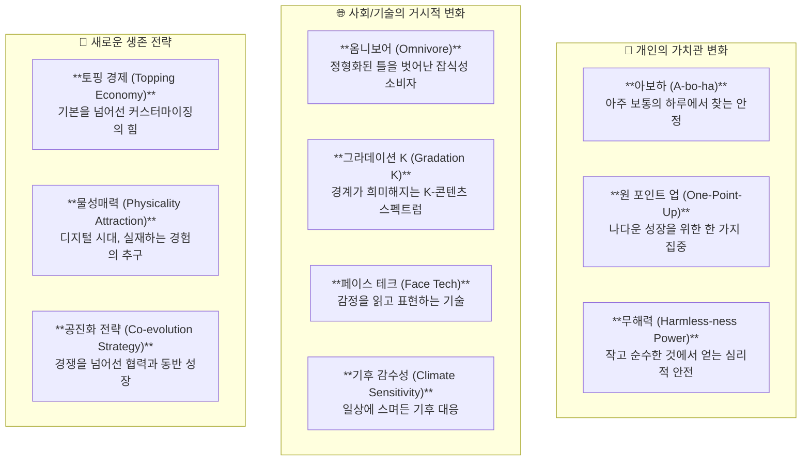
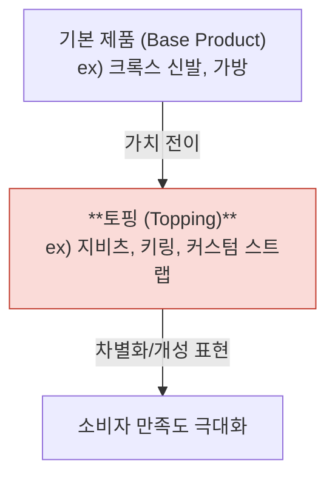
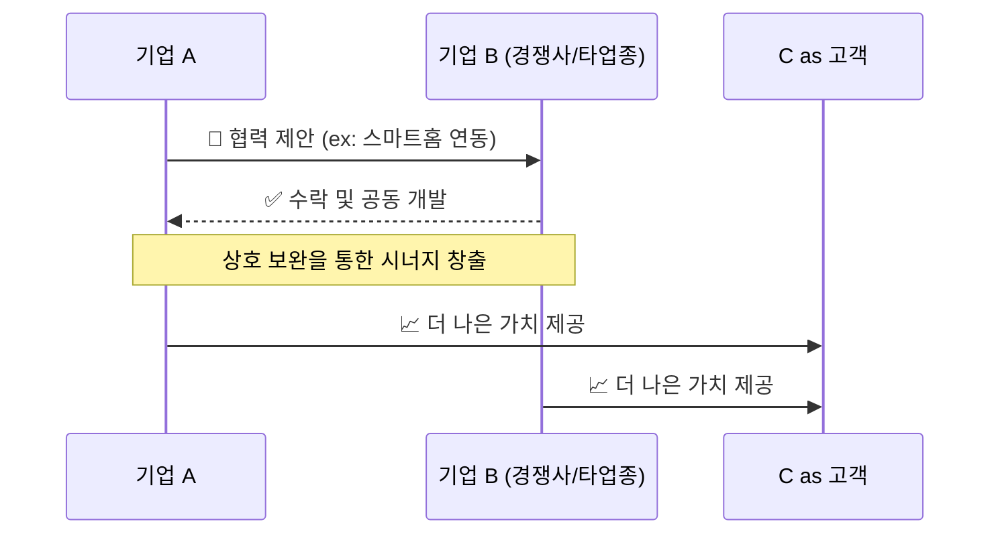

# 📈 트렌드 코리아 2025: 김난도 교수가 제시하는 10가지 미래 나침반

---

## 🚀 들어가며: 2025년, 우리는 어디로 향하는가?

김난도 교수가 이끄는 서울대학교 소비트렌드분석센터가 제시하는 '트렌드 코리아 2025'는 단순한 예측을 넘어, 다가올 미래를 준비하는 우리 모두에게 중요한 나침반이 되어 줍니다. 2025년은 경기 침체의 그림자가 짙게 깔린 불확실성의 시대이지만, 그 속에서도 새로운 기회는 싹트고 있습니다.

이 문서는 2025년의 10대 소비 트렌드 키워드를 심도 있게 분석하고, 각 트렌드가 개인의 삶과 비즈니스에 어떤 의미를 가지는지 시각적인 자료와 함께 명쾌하게 풀어냅니다.

### 🎨 2025년 10대 트렌드 키워드 한눈에 보기

2025년의 트렌드는 크게 **'개인의 변화', '사회/기술의 거시적 변화', '생존 전략'** 세 가지 축으로 나누어 볼 수 있습니다.

---

## 🔍 10대 트렌드 키워드 심층 분석

### 1. **옴니보어 (Omnivore): 잡식성 소비자**

'옴니보어'는 더 이상 나이, 성별, 소득과 같은 전통적인 인구통계학적 기준으로 소비자를 분류할 수 없게 되었음을 의미합니다. 개인의 취향과 가치관이 극도로 다변화되면서 한 사람이 클래식과 트로트를 동시에 즐기고, 명품과 다이소 제품을 함께 소비하는 시대입니다.

*   **핵심**: 집단의 특성보다 개인의 차이가 중요해짐.
*   **시사점**: 타겟 마케팅의 종말. 이제는 특정 '집단'이 아닌 다양한 '상황'과 '취향'에 맞는 유연한 전략이 필요합니다.

### 2. **아보하 (A-bo-ha): 아주 보통의 하루**

'소확행(작지만 확실한 행복)'을 넘어, 이제는 행복해야 한다는 강박마저 내려놓고 '아주 보통의 하루'의 무탈함과 평온함에서 가치를 찾는 트렌드입니다. 특별한 이벤트가 아닌, 매일의 루틴(필사, 운동, 감사일기 등)을 성실히 수행하는 것에서 만족을 얻습니다.

*   **핵심**: 거창한 성공보다 일상의 성실함과 안정감을 중시.
*   **시사점**: 화려한 경험을 제공하는 마케팅보다, 소비자의 평범한 일상을 더 가치있게 만들어주는 제품과 서비스가 주목받을 것입니다.

### 3. **토핑 경제 (Topping Economy)**

기본 제품 위에 소비자가 직접 개성을 추가하는 '토핑'이 본제품의 가치를 뛰어넘는 현상입니다. 크록스 신발의 '지비츠'나 스마트폰 케이스, 가방에 다는 키링 등이 대표적입니다. 배보다 배꼽이 더 커지는 경제입니다.

*   **핵심**: 소비자가 직접 참여하여 자신만의 상품을 완성하는 재미와 개성 추구.
*   **시사점**: 완성품을 파는 시대에서, 소비자가 '꾸밀 여지'를 남겨두는 모듈형 제품 설계나 다양한 커스터마이징 옵션 제공이 중요해집니다.

### 4. **페이스 테크 (Face Tech): 감성의 기술**

인공지능(AI)과 로봇이 인간의 표정을 읽어 감정을 파악하거나, 반대로 기계에 인간적인 얼굴과 표정을 부여하여 친근감을 높이는 기술입니다. 운전자의 졸음을 감지하는 자동차나, 친절한 표정으로 주문을 받는 키오스크 등이 해당됩니다.

*   **핵심**: 기술과 인간 사이의 상호작용을 '감성'의 영역으로 확장.
*   **시사점**: 복잡한 기술일수록 사용법을 쉽게 인지시키는 '어포던스(Affordance)'가 중요하며, '표정'은 최고의 어포던스 디자인 요소가 될 것입니다.

### 5. **무해력 (Harmless-ness Power): 순수함의 힘**

각종 사건사고와 경쟁에 지친 사람들이 작고, 귀엽고, 순수한 것들에서 심리적 안전감을 얻으려는 경향입니다. 푸바오 열풍이나 아기 동물 영상, 어설프지만 귀여운 캐릭터에 열광하는 현상이 이를 증명합니다.

*   **핵심**: 나에게 해를 끼치지 않는 존재를 통해 통제감과 안정감을 회복하려는 욕구.
*   **시사점**: 공격적이고 자극적인 콘텐츠보다, 소비자에게 정서적 위안과 편안함을 주는 '무해한' 마케팅과 디자인이 강력한 힘을 발휘합니다.

### 6. **그라데이션 K (Gradation K): 경계 없는 K-컬처**

이제 K-콘텐츠, K-문화는 '한국적인 것'과 '세계적인 것'으로 이분법적으로 나눌 수 없습니다. 외국인 멤버로 구성된 K-POP 그룹, 해외에서 한국 시스템으로 제작되는 콘텐츠처럼, 다양한 요소가 섞이며 그라데이션처럼 스며들고 있습니다.

*   **핵심**: K-문화의 정체성이 고정된 실체가 아닌, 연속선상의 한 점으로 변화.
*   **시사점**: '가장 한국적인 것이 가장 세계적'이라는 명제를 넘어, 현지 문화와 어떻게 조화롭게 융합하고 새로운 가치를 만들어내는지가 K-콘텐츠의 새로운 성공 공식이 될 것입니다.

### 7. **물성매력 (Physicality Attraction): 만져지는 경험**

디지털화가 가속화될수록 역설적으로 사람들은 실재하는 물질, 즉 '물성'을 직접 만지고 경험하려는 욕구가 강해집니다. 온라인 콘텐츠의 팝업 스토어, 브랜드 굿즈, 촉각을 자극하는 제품 디자인 등이 인기를 끄는 이유입니다.

*   **핵심**: 보이지 않는 가치(콘텐츠, 브랜드)를 만질 수 있는 형태로 구현하여 경험을 극대화.
*   **시사점**: 온라인 경험과 오프라인 경험의 시너지를 창출하는 것이 중요. 고객이 브랜드를 오감으로 체험할 수 있는 공간과 제품을 기획해야 합니다.

### 8. **기후 감수성 (Climate Sensitivity)**

기후 변화가 더 이상 북극곰의 이야기가 아닌, 나의 생존을 위협하는 '내 일'이 되면서 나타나는 소비 태도의 변화입니다. 폭염으로 양우산 수요가 급증하고, 예측 불가능한 날씨에 대응하는 새로운 상품과 서비스가 등장합니다.

*   **핵심**: 기후 문제를 '나의 문제'로 인식하고, 소비와 일상에서 해결책을 찾으려는 태도.
*   **시사점**: 친환경은 더 이상 선택이 아닌 필수. 기업은 기후 변화에 대응하는 비즈니스 모델을 개발하고, 정부는 기후 약자를 위한 새로운 복지 정책을 고민해야 합니다.

### 9. **공진화 전략 (Co-evolution Strategy): 함께 진화하기**

치열한 경쟁 환경과 복잡한 기술 생태계 속에서 더 이상 한 기업이 모든 것을 독점할 수 없습니다. 경쟁사와도 손을 잡고, 서로 다른 산업이 연결되어 함께 성장하는 '공진화'가 새로운 생존 전략으로 떠오르고 있습니다.

*   **핵심**: 폐쇄적인 '우리 생태계'를 넘어, 개방적인 협력을 통해 함께 파이를 키우는 전략.
*   **시사점**: 나의 강점과 타인의 강점을 연결하여 새로운 가치를 만드는 '조인트 사고'가 필요. 누가 나의 최고의 파트너가 될 수 있을지 끊임없이 탐색해야 합니다.

### 10. **원 포인트 업 (One-Point-Up): 나다운 한 뼘 성장**

'갓생'처럼 모든 것을 바꾸려는 거창한 자기계발이 아니라, '가장 나다운' 영역에서 단 '한 가지'만이라도 꾸준히 발전시키려는 트렌드입니다. 롤모델을 무작정 따르기보다, 자신의 강점을 발견하고 그것을 조금 더 잘하기 위해 노력합니다.

*   **핵심**: 총체적 개조가 아닌, 나다움을 잃지 않는 선에서 실천 가능한 작은 성공을 추구.
*   **시사점**: 개인에게는 '내가 잘하는 것은 무엇인가'에 대한 탐색이, 기업에게는 구성원의 다양한 강점을 인정하고 발전시킬 수 있는 유연한 조직 문화 조성이 중요해집니다.

---

## 맺으며: 변화의 파도 속에서 기회를 잡는 법

'트렌드 코리아 2025'가 제시하는 10개의 키워드는 우리에게 위기이자 기회입니다. 고정관념에서 벗어나 잡식성 소비자(옴니보어)의 시각으로 세상을 보고, 평범한 하루(아보하)의 가치를 발견하며, 작은 성공(원 포인트 업)을 쌓아가는 개인은 어떤 변화에도 흔들리지 않을 것입니다.

또한, 협력(공진화 전략)을 통해 함께 성장하고, 기술에 감성(페이스 테크)을 더하며, 실재하는 경험(물성매력)의 가치를 되새기는 기업만이 2025년의 승자가 될 것입니다. 이 문서가 다가올 미래를 대비하는 당신만의 전략을 세우는 데 의미있는 영감을 주길 바랍니다. 