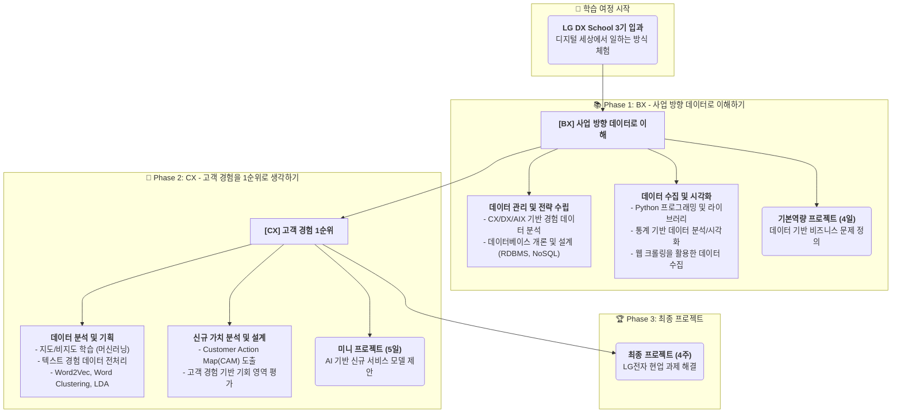

# 🗺️ LG DX School 학습 로드맵

LG DX School의 전체적인 학습 흐름을 한눈에 파악할 수 있는 다이어그램입니다. 각 단계별 학습 목표와 주요 교과목, 그리고 프로젝트까지의 전체 여정을 시각적으로 보여줍니다.

```mermaid
graph TD
    subgraph "🚀 학습 여정 시작"
        A("<strong>LG DX School 3기 입과</strong><br/>디지털 세상에서 일하는 방식 체험")
    end

    subgraph "📚 Phase 1: BX - 사업 방향 데이터로 이해하기"
        B["<strong>[BX] 사업 방향 데이터로 이해</strong>"]
        B --> B1["<strong>데이터 관리 및 전략 수립</strong><br/>- CX/DX/AIX 기반 경험 데이터 분석<br/>- 데이터베이스 개론 및 설계 (RDBMS, NoSQL)"]
        B --> B2["<strong>데이터 수집 및 시각화</strong><br/>- Python 프로그래밍 및 라이브러리<br/>- 통계 기반 데이터 분석/시각화<br/>- 웹 크롤링을 활용한 데이터 수집"]
        B --> P1("<strong>기본역량 프로젝트 (4일)</strong><br/>데이터 기반 비즈니스 문제 정의")
    end

    subgraph "🤝 Phase 2: CX - 고객 경험을 1순위로 생각하기"
        C["<strong>[CX] 고객 경험 1순위</strong>"]
        C --> C1["<strong>데이터 분석 및 기획</strong><br/>- 지도/비지도 학습 (머신러닝)<br/>- 텍스트 경험 데이터 전처리<br/>- Word2Vec, Word Clustering, LDA"]
        C --> C2["<strong>신규 가치 분석 및 설계</strong><br/>- Customer Action Map(CAM) 도출<br/>- 고객 경험 기반 기회 영역 평가"]
        C --> P2("<strong>미니 프로젝트 (5일)</strong><br/>AI 기반 신규 서비스 모델 제안")
    end

    subgraph "🏆 Phase 3: 최종 프로젝트"
        D("<strong>최종 프로젝트 (4주)</strong><br/>LG전자 현업 과제 해결")
    end

    A --> B --> C --> D
``` 