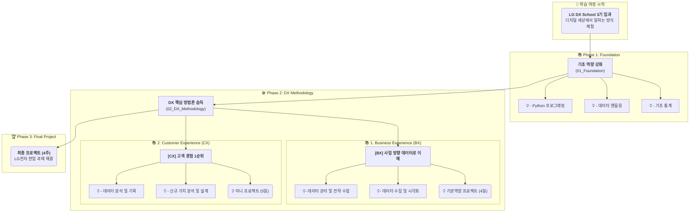

# 🗺️ LG DX School 학습 로드맵

LG DX School의 전체적인 학습 흐름을 한눈에 파악할 수 있는 다이어그램입니다. 폴더 구조와 일치하도록 DX 방법론 중심으로 재구성했습니다.

```mermaid
graph TD
    subgraph "🚀 학습 여정 시작"
        A("<strong>LG DX School 3기 입과</strong><br/>디지털 세상에서 일하는 방식 체험")
    end

    subgraph "📚 Phase 1: Foundation"
        F["<strong>기초 역량 강화</strong><br/>(01_Foundation)"]
        F --> F1["💡 - Python 프로그래밍"]
        F --> F2["💡 - 데이터 핸들링"]
        F --> F3["💡 - 기초 통계"]
    end

    subgraph "🛠️ Phase 2: DX Methodology"
        DX["<strong>DX 핵심 방법론 습득</strong><br/>(02_DX_Methodology)"]
        
        subgraph "📚 1. Business Experience (BX)"
            B["<strong>[BX] 사업 방향 데이터로 이해</strong>"]
            B --> B1["💡- 데이터 관리 및 전략 수립"]
            B --> B2["💡- 데이터 수집 및 시각화"]
            B --> P1("💡 기본역량 프로젝트 (4일)")
        end

        subgraph "📚 2. Customer Experience (CX)"
            C["<strong>[CX] 고객 경험 1순위</strong>"]
            C --> C1["💡 - 데이터 분석 및 기획"]
            C --> C2["💡 - 신규 가치 분석 및 설계"]
            C --> P2("💡 미니 프로젝트 (5일)")
        end

        DX --> B & C
    end

    subgraph "🏆 Phase 3: Final Project"
        D("<strong>최종 프로젝트 (4주)</strong><br/>LG전자 현업 과제 해결")
    end

    A --> F --> DX --> D
``` 